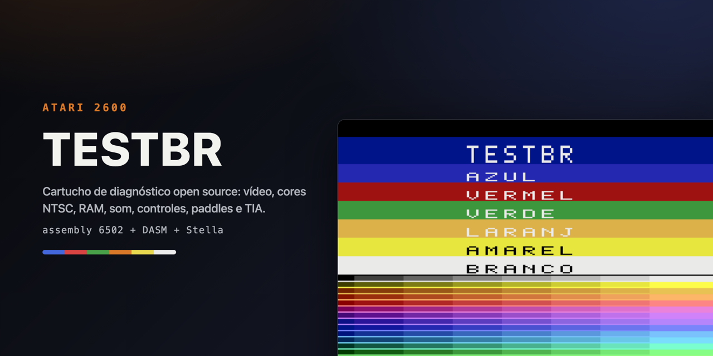
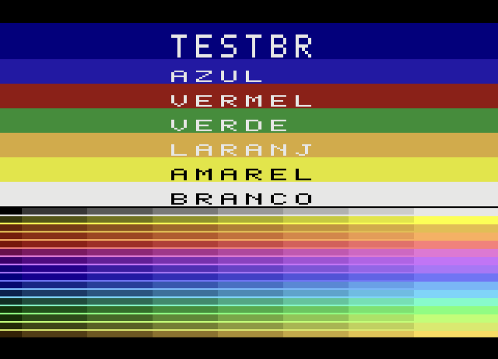
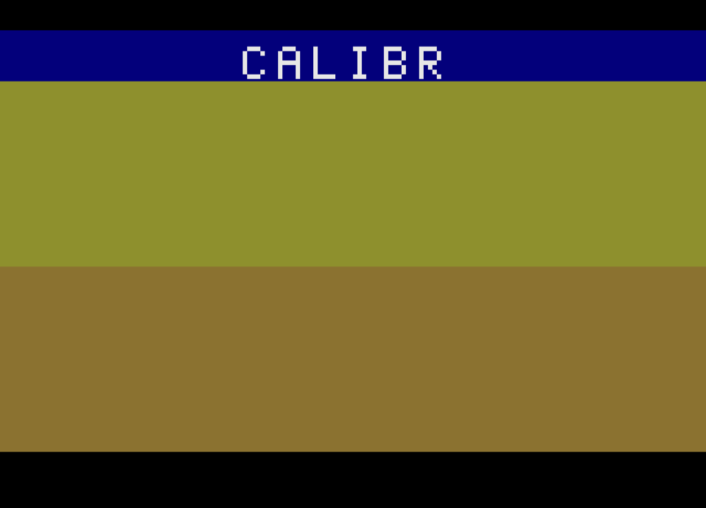
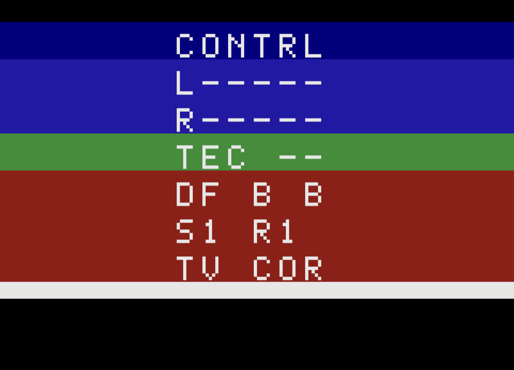
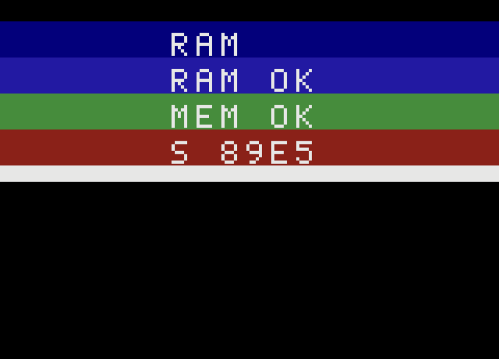
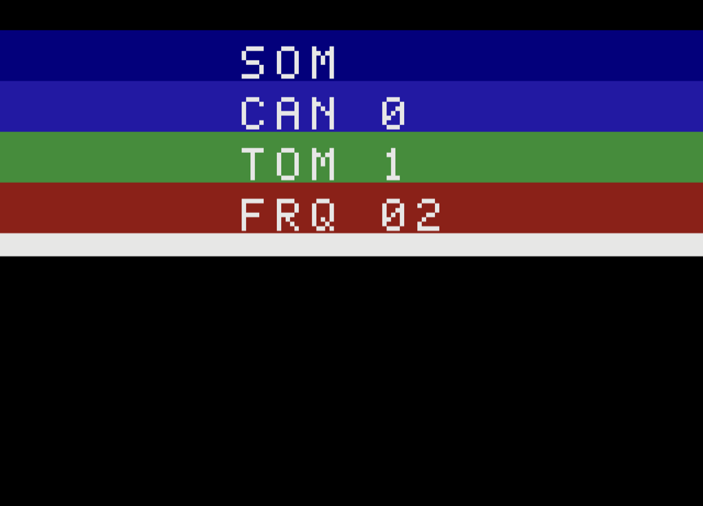
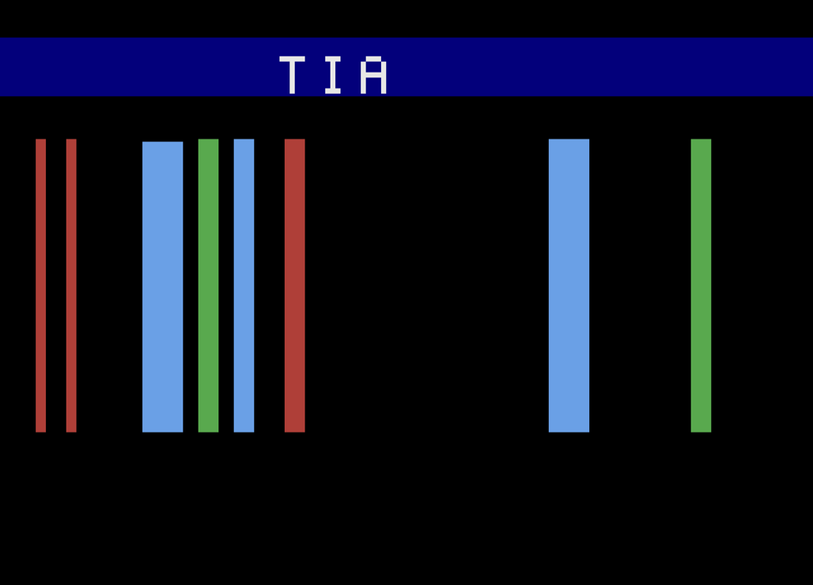
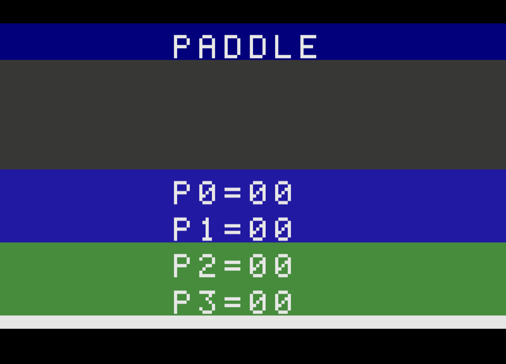
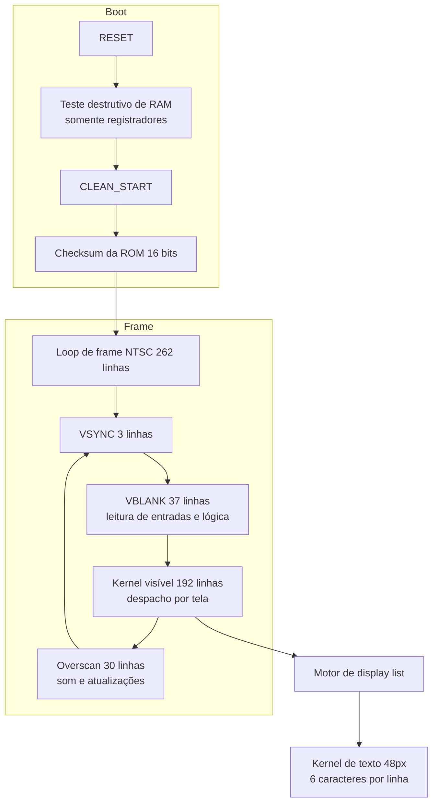

# TESTBR - Cartucho de diagnóstico para Atari 2600

<p align="center">
  
</p>

<p align="center">
  <a href="https://github.com/giacomeli/AtariTestCartridgeBR/releases/latest"></a>
  
  
  
</p>

ROM open source de diagnóstico completo para o console Atari 2600, inspirada
funcionalmente no Testcart da AtariAge. Escrita do zero em assembly 6502
(6507), montada com DASM e testável no emulador Stella sem necessidade de
hardware real.

> **EN** — TESTBR is an open source diagnostic test cartridge (4K ROM) for
> the Atari 2600 / VCS, written from scratch in 6502 (6507) assembly,
> assembled with DASM and testable in the Stella emulator. It tests video
> output and the full NTSC color palette, TIA objects, RIOT RAM, sound,
> joysticks, keypads, paddles and console switches, and runs on real
> hardware via Harmony, UnoCart or PlusCart flash cartridges or a 4K
> EPROM. Documentation is in Brazilian Portuguese.

## Objetivo

Permitir o diagnóstico de um console Atari 2600 real (TIA, RIOT, CPU,
controles e chaves do console) gravando a ROM em um cartucho flash
(Harmony, UnoCart, PlusCart) ou EPROM de 4K.

## Telas de teste

A chave SELECT avança para a próxima tela. O joystick esquerdo também
navega (direita = próxima, esquerda = anterior), exceto na tela de
controles, onde o próprio joystick está sob teste.

| Tela | Nome | O que testa |
| --- | --- | --- |
| 1 | ARTE (splash) | Experimental (WIP): splash screen com pixel art criada no tools/pixel-editor.html; avança sozinha para a próxima tela após 7 segundos ou com SELECT. 32 pixels de largura, sem flicker: duas cópias de cada player com reescrita de GRP no meio da scanline via VDEL, e banda de playfield espelhado atrás dos furos do sprite para detalhes como olhos/boca. Pode não entrar na versão final |
| 2 | TESTBR (cores) | Saída de vídeo: barras nomeadas (azul, vermelho, verde, laranja, amarelo e branco, com texto de altura simples) e o gerador de barras de cor com as 128 cores NTSC (16 matizes x 8 luminâncias, a escala de cinza na primeira linha da grade) |
| 3 | CALIBR | Calibração do trimpot de cor: faixas com os matizes 1 e 15, que devem ficar idênticas quando o ajuste está correto |
| 4 | CONTRL | Joysticks (setas e botão), teclados numéricos (keypad), chaves de dificuldade, SELECT/RESET e chave TV COR/PB |
| 5 | RAM | Teste destrutivo de power-up da RAM do RIOT (55/AA/eco de endereço), teste contínuo não destrutivo em background e checksum da ROM |
| 6 | SOM | Varredura automática de timbres (AUDC 0-15) e frequências (AUDF 0-31), alternando o canal a cada timbre |
| 7 | TIA | Players, mísseis e ball em movimento (RESP/HMOVE) sobre playfield |
| 8 | PADDLE | Leitura analógica dos 4 paddles (INPT0-3) em hexadecimal |

### Capturas de tela

| | |
| --- | --- |
|  |  |
| Cores nomeadas e paleta NTSC completa | Calibração do trimpot de cor |
|  |  |
| Controles e chaves | RAM e checksum da ROM |
|  |  |
| Som | Objetos do TIA em movimento |
|  | |
| Paddles | |

### Calibração das cores do console (tela CALIBR)

Os matizes 1 e 15 ficam nos dois extremos da linha de atraso de fase do
TIA; quando o trimpot interno de cor está ajustado corretamente, as duas
faixas da tela CALIBR aparecem com a mesma cor. Procedimento (consoles
NTSC; o trimpot fica acessível por um furo na parte inferior da carcaça):

1. Deixe o console esfriar por pelo menos 45 minutos.
2. Ligue o console já com a tela CALIBR aberta.
3. Gire o trimpot com uma chave de fenda pequena até as duas faixas
   ficarem idênticas.
4. Conforme o circuito esquenta as cores derivam um pouco; o ajuste de
   referência é com o aparelho ainda frio.

Em emulador as faixas nunca coincidem exatamente (a paleta NTSC do
Stella distingue os dois matizes de propósito); o ajuste só faz sentido
em hardware real.

### Leitura da tela CONTRL

| Linha | Significado |
| --- | --- |
| `L ....F` / `R ....F` | Setas acendem com as direções do joystick; `F` acende com o botão, que também toca um tom no canal de áudio correspondente (esquerdo = canal 0, direito = canal 1) |
| `TEC x y` | Última tecla dos keypads esquerdo/direito (`X` = asterisco, `H` = cerquilha) |
| `DF A B` | Chaves de dificuldade esquerda/direita (`A` = expert, `B` = novato) |
| `S1 R1` | Estado bruto de SELECT e RESET (0 = pressionado) |
| `TV COR` | Chave COLOR/BW |

## Estrutura do projeto

| Caminho | Conteúdo |
| --- | --- |
| `src/main.asm` | Boot, testes de power-up, loop de frame e navegação |
| `src/engine.asm` | Motor de display list e kernel de texto de 48px |
| `src/screens.asm` | Display lists, strings e kernels de cada tela |
| `src/font.asm` | Fonte 5x7 (43 glifos) |
| `include/` | `vcs.h` e `macro.h` (headers padrão da comunidade, distribuídos com o DASM) |
| `tools/` | Toolchain local: DASM, Stella e scripts de verificação |
| `roms/` | Artefatos de build (`testbr.bin`) |

## Requisitos

- macOS ou Linux com `make`, `cc` e `git`
- DASM (montador 6502): https://github.com/dasm-assembler/dasm
- Stella (emulador): https://github.com/stella-emu/stella

Este repositório instala a toolchain localmente em `tools/` (não versionada,
ver `.gitignore`):

```sh
git clone --depth 1 https://github.com/dasm-assembler/dasm.git tools/dasm-src
make -C tools/dasm-src
cp tools/dasm-src/bin/dasm tools/
```

Para o Stella no macOS, baixe o `.dmg` da release e copie o `Stella.app`
para `tools/stella/`.

## Build e execução

```sh
make        # monta roms/testbr.bin (4096 bytes)
make run    # abre a ROM no Stella
make sim    # smoke test headless: 4 frames no tools/sim2600
make shot   # abre no Stella e salva screenshot em shots/
```

Flags de build úteis (via DASM `-D`):

| Flag | Efeito |
| --- | --- |
| `-DSTARTSCR=n` | Inicia direto na tela `n` (0-7), útil para depuração |
| `-DCALIB=1` | Liga a régua de playfield (pixels 44-47 e 124-127) para calibrar `POSX` |
| `-DPOSX=n` | Sobrepõe a posição horizontal do texto (calibrada em 58) |

## Simulando as entradas do console no Stella

Teclas padrão do Stella 7.0 (remapeáveis em Options -> Input Settings).
Fonte: documentação embutida do emulador
(`tools/stella/Stella.app/Contents/Resources/docs/index.html`).

### Chaves do console

| Entrada do console | Tecla | Onde aparece na ROM |
| --- | --- | --- |
| SELECT | F1 | Avança de tela; linha `S_ R_` mostra 0 enquanto pressionada |
| RESET | F2 | Linha `S_ R_` mostra 0 enquanto pressionada |
| TV COLOR | F3 | Linha `TV COR` |
| TV BLACK/WHITE | F4 | Linha `TV PB` |
| Dificuldade esquerda A / B | F5 / F6 | Linha `DF _ _` (primeira letra) |
| Dificuldade direita A / B | F7 / F8 | Linha `DF _ _` (segunda letra) |

### Joysticks (tipo de controle padrão)

| Função | Joystick esquerdo | Joystick direito |
| --- | --- | --- |
| Cima | Seta cima | Y |
| Baixo | Seta baixo | H |
| Esquerda | Seta esquerda | G |
| Direita | Seta direita | J |
| Botão (fire) | Ctrl esquerdo, Espaço | F |

Na tela CONTRL as linhas `L` e `R` acendem as setas e o `F` conforme as
teclas acima. Nas demais telas, direita/esquerda do joystick esquerdo
navegam entre as telas.

### Keypads (teclados numéricos)

O Stella só emula keypad se o tipo de controle for `Keyboard`; use:

```sh
make run-keypad     # equivale a: Stella -lc Keyboard -rc Keyboard rom
```

| Tecla do keypad | Keypad esquerdo | Keypad direito |
| --- | --- | --- |
| 1 2 3 | 1 2 3 | 8 9 0 |
| 4 5 6 | Q W E | I O P |
| 7 8 9 | A S D | K L ; |
| * 0 # | Z X C | , . / |

A linha `TEC` da tela CONTRL mostra a última tecla de cada keypad
(`X` = asterisco, `H` = cerquilha).

### Paddles

O Stella só emula paddles se o tipo de controle for `Paddles`; use:

```sh
make run-paddle     # equivale a: Stella -lc Paddles -rc Paddles rom
```

| Função | Porta esquerda | Porta direita |
| --- | --- | --- |
| Paddle A girar | Setas esquerda/direita (ou mouse) | G / J |
| Paddle B girar | Setas cima/baixo | Y / H |

No Stella o paddle A da porta esquerda também segue o mouse por padrão.
Na tela PADDLE, `P0`-`P3` medem o tempo de carga do potenciômetro em
scanlines (00-40 hex): com o paddle girado para um extremo a carga é
instantânea e o valor fica `00`; girando, o valor sobe até `40`. Sem
paddle conectado o valor fica travado (em geral `00`).

## Ferramentas de verificação

| Ferramenta | Uso |
| --- | --- |
| `tools/sim2600.c` | Simulador mínimo de 6507+TIA/RIOT: mapa de frame linha a linha (`sim2600 rom 4`), dump de writes no TIA (`-w`), preview ASCII dos sprites (`-p ini fim`), pressionar SELECT (`-s n`), dump de RAM (`-r`). Detecta opcodes ilegais e valida os 262 scanlines NTSC em CI |
| `tools/snapshot.sh` | Abre a ROM no Stella, captura screenshot só da janela do emulador e fecha |
| `tools/winid.m` | Helper que localiza a janela do Stella para o `screencapture` |
| `tools/pixel-editor.html` | Editor de pixel art para as telas da ROM (abrir direto no navegador, sem dependências) |
| `tools/arte-convert.py` | Converte a matriz JSON exportada pelo editor nas tabelas DASM da tela ARTE (formato sem flicker, com furos + banda de playfield) |
| `tools/arte-server.py` | Servidor local do editor (`make editor`): botão "Gravar na ROM" converte a arte, grava em src/screens.asm e compila; "Abrir no Stella" testa na hora |

## Editor de pixel art

> **Aviso (WIP):** o editor de pixel art e a tela ARTE são experimentais
> e estão em desenvolvimento. Podem mudar a qualquer momento e não há
> garantia de que serão incluídos na versão final do cartucho.

O `tools/pixel-editor.html` é um editor de sprites/telas em um único
arquivo HTML. Fluxo recomendado: `make editor` sobe o servidor local
(`tools/arte-server.py`, porta 2600, só 127.0.0.1) e abre o editor no
navegador; o botão **Gravar na ROM** converte a arte, substitui o
bloco entre os marcadores `ARTE-TABELAS` em `src/screens.asm` e roda
o make — e **Abrir no Stella** testa na hora, sem copiar e colar
nada. A conversão (tools/arte-convert.py, também utilizável via CLI
com a matriz JSON exportada) gera as tabelas `ArtP0-3/ArtC0-1/
ArtPF/ArtCF` da tela ARTE no formato sem flicker: detalhes de cor
extra viram furos no sprite cobertos por uma banda de playfield, e
pixels que não cabem no limite do TIA (1 cor por player + 1 cor de
banda por linha) são aproximados pela cor mais próxima, com aviso no
próprio editor. O botão "Gerar DASM" ainda produz o formato antigo
por dominância (`IcoP*/IcoC*`), que é lossy; prefira o fluxo acima.

| Recurso | Detalhe |
| --- | --- |
| Toolbox | Lápis (P), lápis espelhado (V), borracha (E), balde (B), conta-gotas (I), linha (L), retângulo (R) e elipse (C); as formas têm prévia fantasma durante o arraste, Shift restringe a proporção e o checkbox "Preencher formas" alterna contorno/preenchido |
| Paleta | As 128 cores NTSC do TIA, com RGB amostrado da renderização real do Stella 7.0 |
| Proporção Atari | Seletor de proporção com o PAR medido na renderização do Stella (~1.92:1 por scanline): modo "1 linha = 2 scanlines" (~0.96:1, padrão, para os sprites de altura dupla do TESTBR), modo "1 linha = 1 scanline" (~1.92:1) e modo quadrado (1:1) |
| Validador do TIA | Confere em tempo real a regra dos players: cada linha aceita 1 cor por grupo de 8 colunas (P0/P1); conflitos aparecem no painel |
| Persistência | Trabalho salvo automaticamente no navegador (localStorage) |
| Entrada/saída | Copiar/baixar matriz JSON, importar JSON, gerar tabelas DASM |

Controles: botão esquerdo aplica a ferramenta ativa (arraste para
varrer), botão direito apaga, Alt + clique é conta-gotas, Esc cancela
uma forma em andamento e Ctrl+Z desfaz.

## Arquitetura



O motor de display list desenha barras horizontais coloridas, cada uma
podendo carregar uma linha de texto de 6 caracteres renderizada com a
técnica clássica de 48 pixels (players com 3 cópias próximas e VDEL).

Notas de implementação aprendidas durante o desenvolvimento:

- A sequência de stores do kernel de texto precisa rodar em TODA
  scanline: as 3 cópias de cada player compartilham um único registrador
  GRP, então a altura dupla vem de linhas duplicadas na própria fonte
  (16 bytes por glifo), e o laço de 14 linhas é desenrolado porque a
  cauda de um laço não cabe nos ciclos restantes da scanline.
- A janela válida de posição horizontal do texto tem ~5 pixels de
  tolerância; `POSX` foi calibrado empiricamente com uma régua de
  playfield e varreduras de screenshot.
- O `CLEAN_START` do `macro.h` usa o opcode ilegal LXA por padrão;
  a ROM define `NO_ILLEGAL_OPCODES` e usa um clear inline que preserva
  o resultado do teste de RAM de power-up.

## Licença

MIT. A toolchain (DASM e Stella) possui licenças próprias (GPL-2.0).
